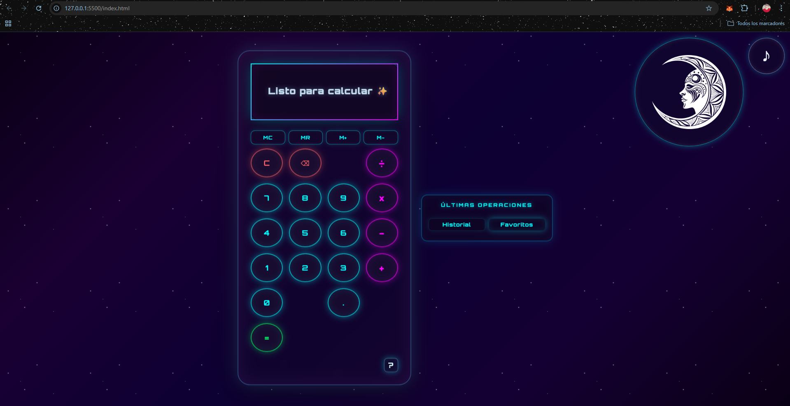
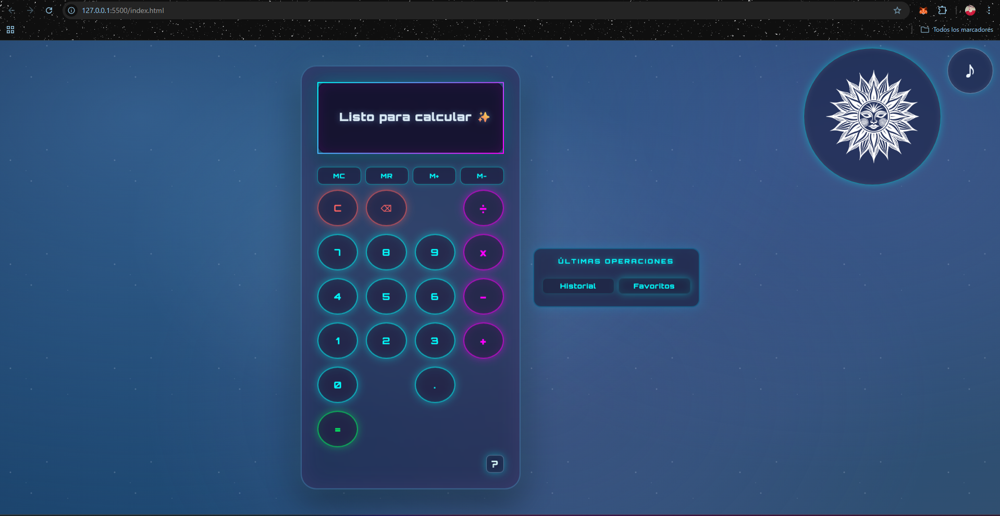

✨ Calcuspace
Calculadora galáctica futurista con experiencia neon interactiva

Calcuspace es una calculadora web con estética espacial y enfoque en la experiencia de usuario.
Combina un diseño neon futurista, animaciones suaves y funcionalidades propias de una calculadora real, todo desarrollado con HTML, CSS y JavaScript vanilla.

---

🌌 Vista previa
🔗 Demo en vivo: https://jessicanolimit.github.io/calcuspace/

---

🌙 Modo dark

☀️ Modo light

## 

🚀 Características

Operaciones básicas (+, −, ×, ÷)

Soporte completo de teclado

Historial de operaciones

Sistema de favoritos persistente

Memoria de cálculo (MC, MR, M+, M−)

Repetición del = para cálculos encadenados

Límite de dígitos con validación de entrada

Estado vacío elegante: “Listo para calcular ✨”

Modo dark / light con botón luna/sol

Animaciones neon sincronizadas con la interacción

Feedback visual en cada tecla

Overlay de atajos de teclado

## Diseño responsive

🧠 Enfoque del proyecto

Este proyecto no busca solo calcular, sino hacer que calcular se sienta bien.

Cada interacción genera una respuesta visual inmediata, manteniendo coherencia entre acción y resultado.
El diseño espacial aporta profundidad sin comprometer la legibilidad, y las funciones avanzadas convierten la calculadora en una pequeña aplicación real.

---

🛠️ Tecnologías

HTML5

CSS3

JavaScript (Vanilla)

## localStorage para persistencia de favoritos

📂 Estructura del proyecto
calcuspace/
├─ index.html
├─ style.css
├─ script.js
├─ README.md
└─ assets/
├─ lunanegra.png
├─ ovni.png
├─ solnegro.png
└─ star-cursor.svg

---

▶️ Cómo usar

Clona el repositorio

Abre index.html con Live Server (o cualquier servidor local)

Empieza a calcular 🚀

📈 Lo que demuestra este proyecto

Manipulación del DOM y gestión de eventos

Gestión de estado en una interfaz interactiva

Persistencia de datos en el navegador

Validación de entrada y control de límites

Diseño responsive

## Decisiones de UX/UI orientadas a claridad y feedback visual

🔮 Líneas futuras

Calcuspace está pensado como un laboratorio de UX interactiva.
Algunas ideas para futuras iteraciones:

Sonidos configurables según la acción

Versión PWA instalable para uso offline

Tests para la lógica de cálculo y validaciones

Temas visuales alternativos dentro del universo galáctico

## Personalización de animaciones y feedback visual

🪐 Autor

Jesica Serrano
Proyecto de aprendizaje enfocado en frontend, UX interactiva y creatividad visual.
